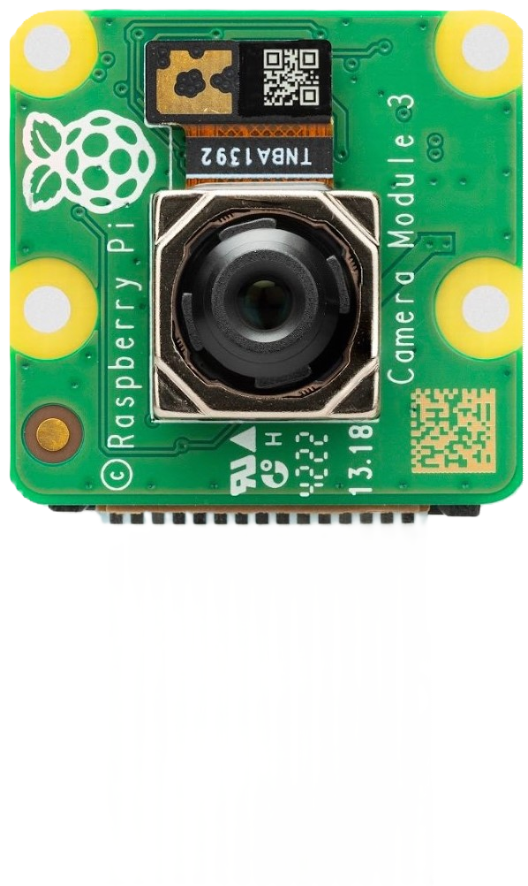
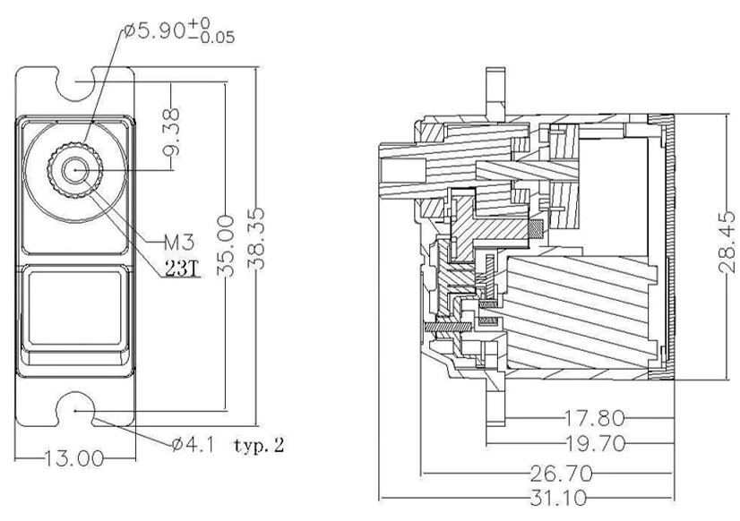
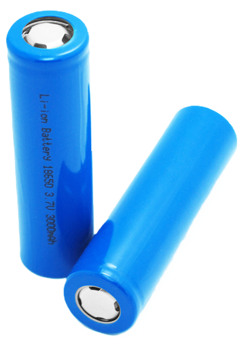
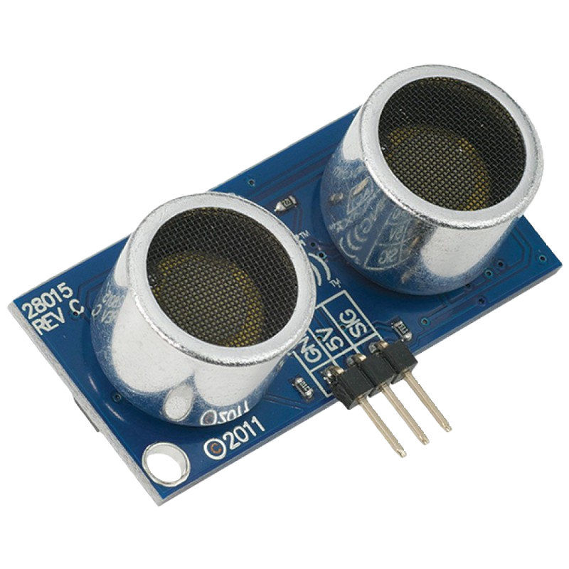
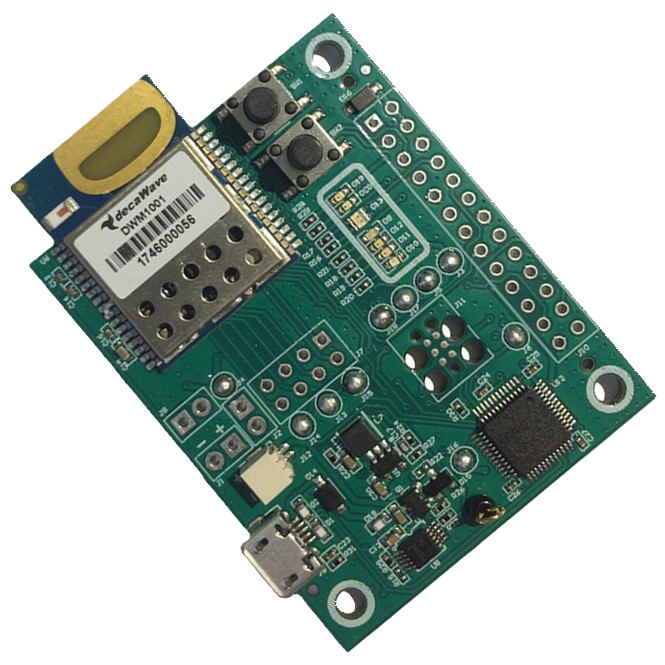

# March 05, 2024
## Ladybug
During this session, I started to work on the Ladybug (mini robots) which will be used to "polenize" the plants. The robots will have to complete this task only during the last 10 seconds of the match. The task is complete if a ladybug touches a plant at the end of the game. Each ladybug will have to be able to move in all directions and to detect the plants. The ladybugs have to be as simple as possible so they are easy to build, easy to program and easy to repair. While moving, a ladybug must avoid any obstacle.

### Motorisation
For the main motor (for the wheels), I chose the 12V DC motor. It is a simple motor that can be powered by a battery. It is also easy to control with PWM and a H-bridge. Because I don't want the robot to be too fast, I will run this motor at 5v and I chose a motor with a planetary gearbox to reduce the speed in a minimum of space.

    

    The motoreducers

### Motherboard
For the main board, I chose the Raspberry Pi Zero W. It is a small and cheap board with a lot of GPIOs. It also has a camera port which will be useful to detect the plants. The Raspberry Pi Zero W is also powerful enough to run a simple AI to avoid obstacles. The Raspberry Pi Zero W will be powered by a 5V battery and will control the motors with a H-bridge. The Wifi will be used to communicate with the main computer and receive and send its position.

    
    

    Raspberry Pi Zero W pinout and the four Raspberry Pi Zero W

### Camera
For the camera, I chose the Raspberry Pi Camera Module V2. It is a small camera that can be connected to the Raspberry Pi Zero W. It is also cheap and easy to use. The camera will be used to detect the plants and to avoid obstacles.

    

    Camera Module V2

### Actuators
For the actuators, I chose a servo motor ES-3054 because it is compact, strong and durable (metal gears). I prefer servo motor for my application because it is super easy to control (self-servoed). I will use a servo motor to move the directive wheel and and one to move the arm that will touch the plant.

    
    

    ES-3054 servo motor

### Battery
For the battery, I chose the 3.7V 1500mAh Li-ion battery. It is a small and light battery that can be recharged. It is also powerful enough to power the Raspberry Pi Zero W and the motors. I will use a step-up to power the Raspberry Pi Zero W with 5V. The battery will also be equipped with a protection circuit to avoid over-discharge and over-charge which can be dangerous (explosion in the worst case). The battery cell will be protected in a Power Bank case to make it easy to recharge and certified for the competition. Without the case, I would have to keep it in a fireproof bag which is not practical.

    
    

    18650 Li-ion battery cell

### Emergency switch
For the competition, I have to add an emergency switch to stop the robot in case of a problem. I chose a simple switch that will cut the power of the robot. The switch will be placed on the top of the robot to be easily accessible.

    

    Emergency switch

### Sensor
For the sensors, I chose the HC-SR04. It is a small and cheap ultrasonic sensor that can measure the distance with enough precision. The sensor will be used to detect obstacles on the front and the sides of the robot. The sensor will be placed in the center top of the robot to have a good view of the environment.

    

    HC-SR04 ultrasonic sensor

For the robot to know its position on the field, I will use a DWM1001-dev module. The module can be used to know the position of the robot with a precision of 5 to 10 cm which is enough. The module will be placed on the top of the robot to have better performance. According to the datasheet, it is better to place the module vertically. The module will communicate with the Raspberry Pi Zero W with UART.

    

    DWM1001-dev module

## Next session
- Design the ladybug with the selected components on SolidWorks
- Adjust some parts of the main robot
