# March 12, 2024
## Main robot
Two session ago, I modeled and printed the system which will hold the plants against the robot's frame. when I tried to mount them on the robot, I realized that the system was a little bit too long. I had to cut it and reassemble it. The difficulty was to cut the guide rail because it is made out of hardened steel so it cannot be cutted with a regular steel saw. Finally I found out that a [Dremel®]('https://www.dremel.com/fr/fr/p/dremel-8260-f0138260ja') with the right blade was able to cut through it whithout too much difficulties.

    

    Cutted rail guide

## Ladybug robot
### Components
Last session, I chose the components for the ladybug robot. Before starting to model the ladybug itself, I modeled on SolidWorks the components that will be used in the robot. I modeled the DC motor, the servo motors and the DWM1001 module. I found the other components on the internet because they are standard. Here are the components I modeled myself on SolidWorks:

    

    DC motor

    

    Servo motor (for the direction)

    

    Servo motor (for the actuator), a bit smaller than the previous one

    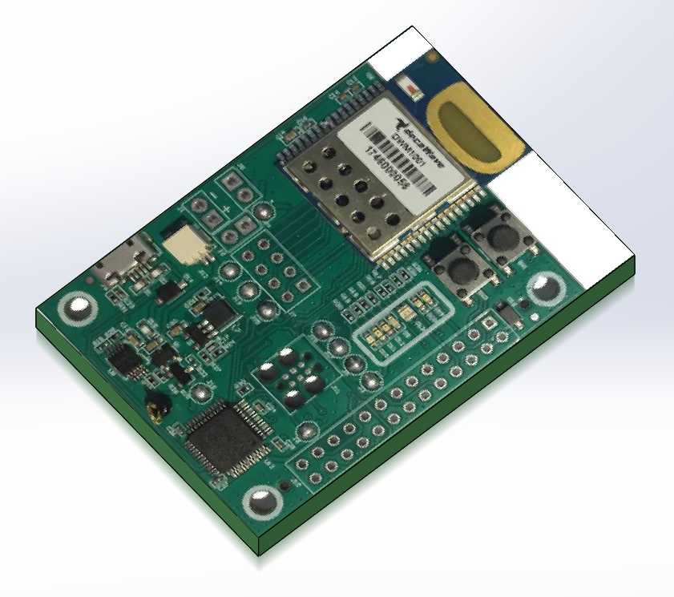

    DWM1001 module

Here are the components I found on the internet ([GrabCAD]('https://grabcad.com/library')):

    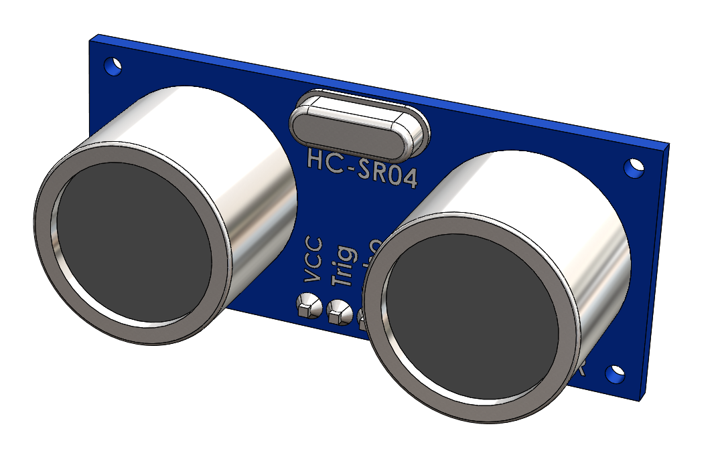

    Ultrasonic sensor

    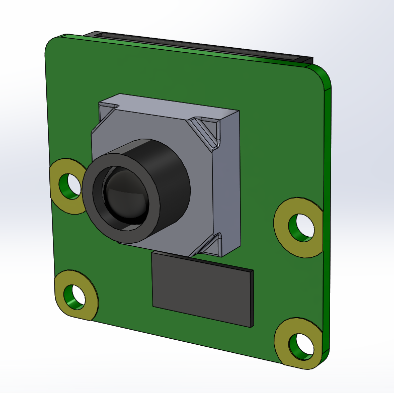

    Raspberry Pi camera

    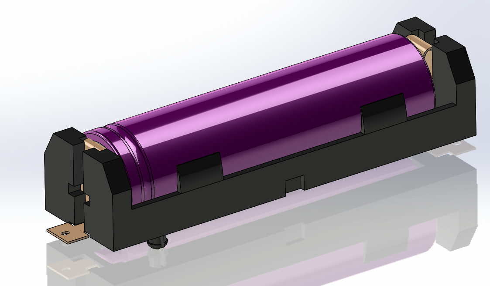

    18650 battery in a holder

    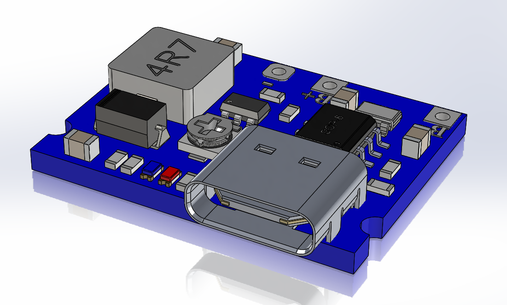

    BMS (Battery Management System) for the 18650 battery and step-up module (3.7V to 5V)

    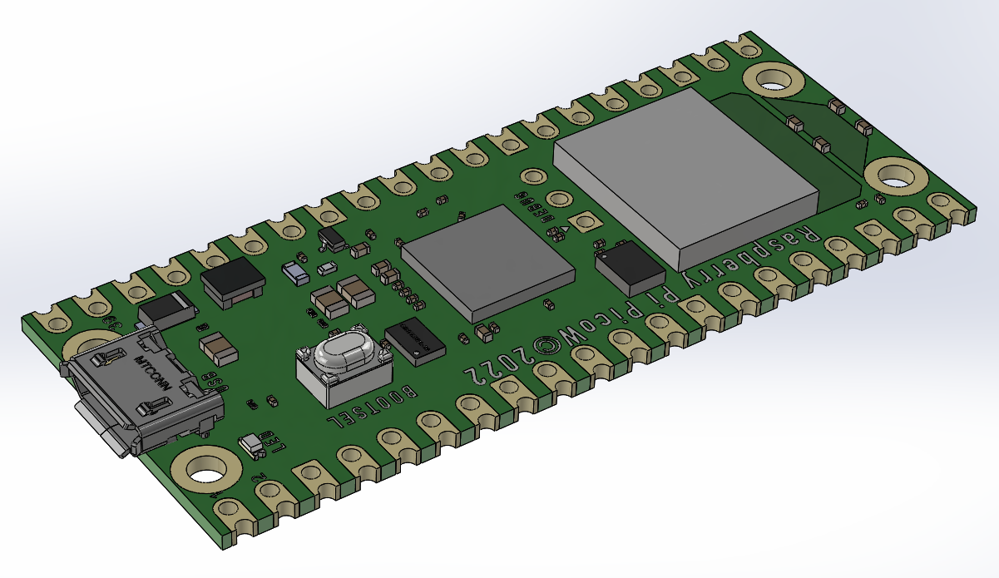

    Raspberry Pi Zero W

    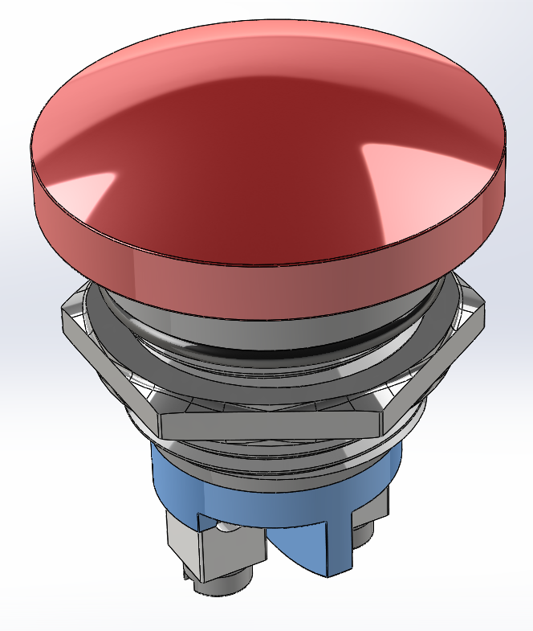

    Emergency stop switch

### Chassis
For the chassis, I modeled it as compact and simple as possible. I designed it so that the DC motor is inside the chassis, so that its mass serves to stabilize the ladybug. The structure of the chassis is very rigid because of its geometry, when can see some holes on the top which are made to screw the other parts on it. Here is the design I came up with:

    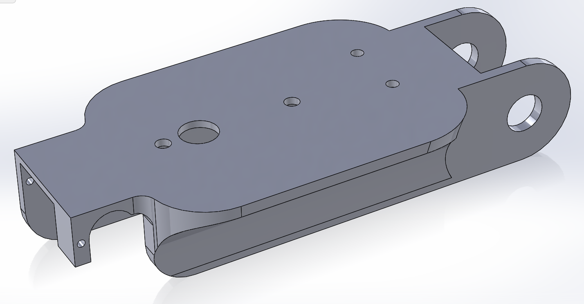

    Chassis (Top view)

    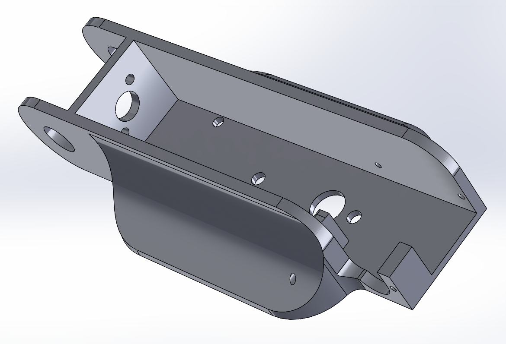

    Chassis (Bottom view)

    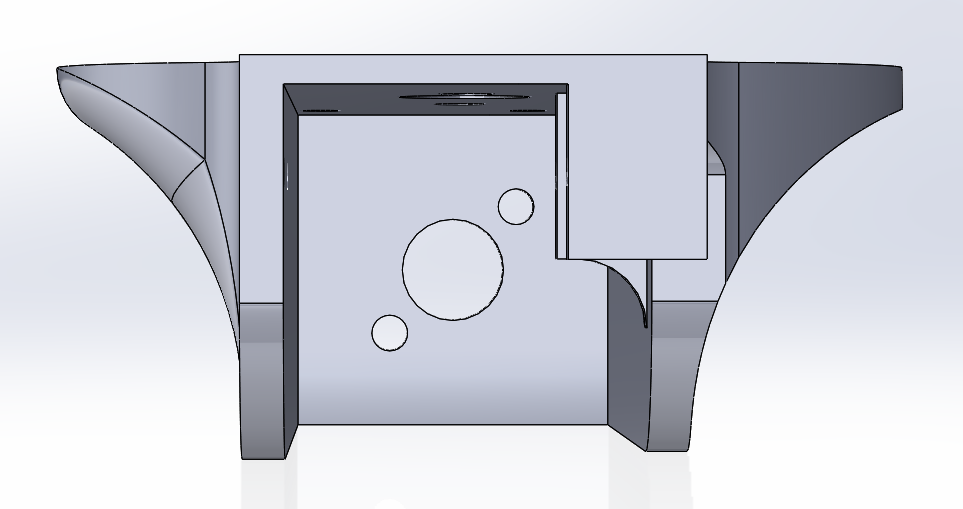

    Chassis (front view)

Then I added to the chassis the DC motor, the servo motor for the direction and the wheels. A small wheel is mounted on a fork which is attached to the servo motor. In order to transmit the rotational power from the DC motor to the wheels, I designed a small gear system. The gear ratio is 1:1, so the wheels will rotate at the same speed as the DC motor which is already designed at the right speed. The wheels might be a little bit too much apart but I will see this detail later. Here is the chassis with the motors and the wheels:

    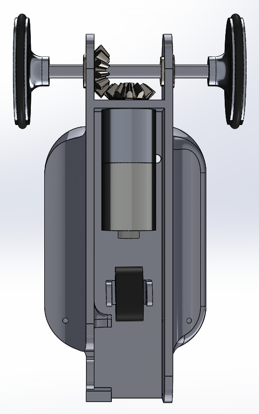

    Chassis with the DC motor, the servo motor and the wheels

