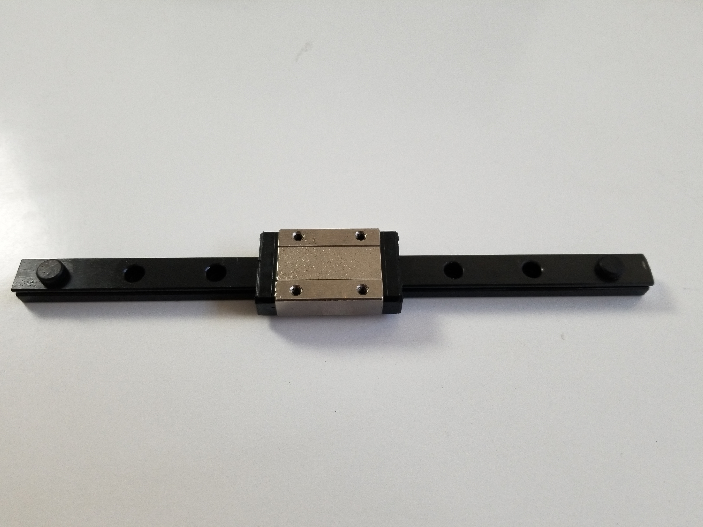

# March 12, 2024
## Main robot
Two session ago, I modeled and printed the system which will hold the plants against the robot's frame. when I tried to mount them on the robot, I realized that the system was a little bit too long. I had to cut it and reassemble it. The difficulty was to cut the guide rail because it is made out of hardened steel so it cannot be cutted with a regular steel saw. Finally I found out that a dremel with the right blade was able to cut through it whithout too much difficulties.

    

    Cutted rail guide

## Ladybug robot
