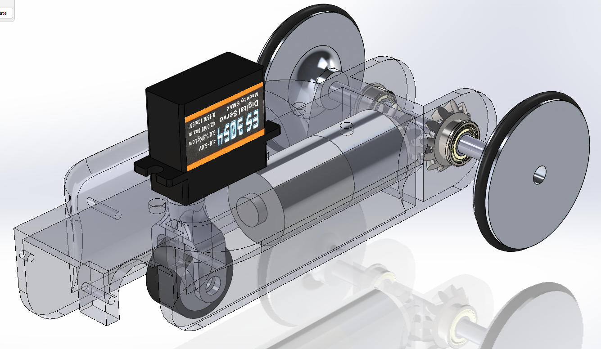
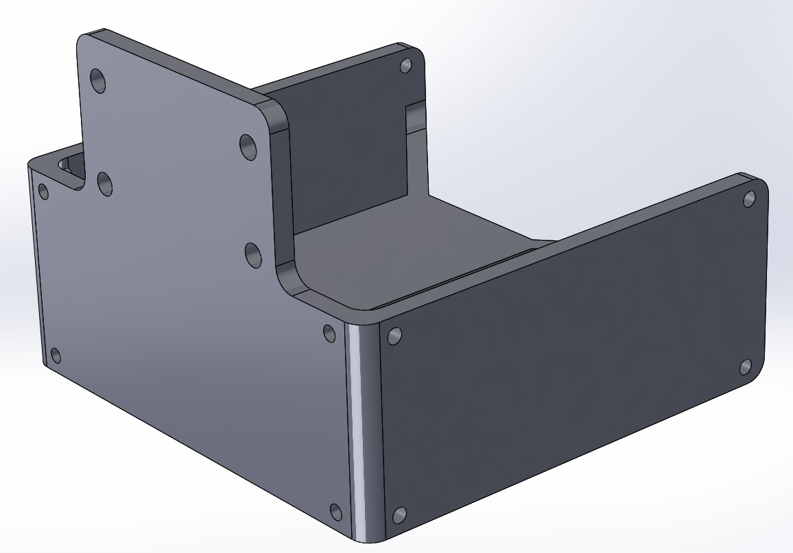
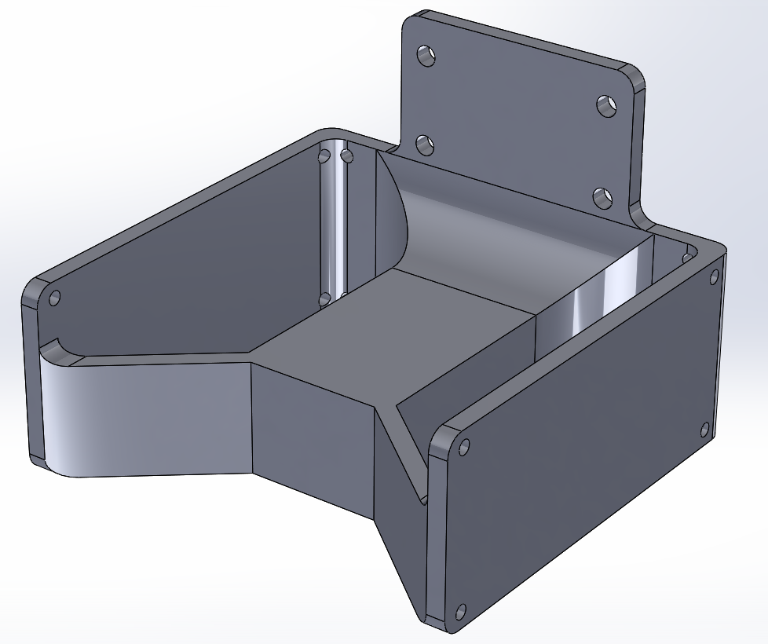
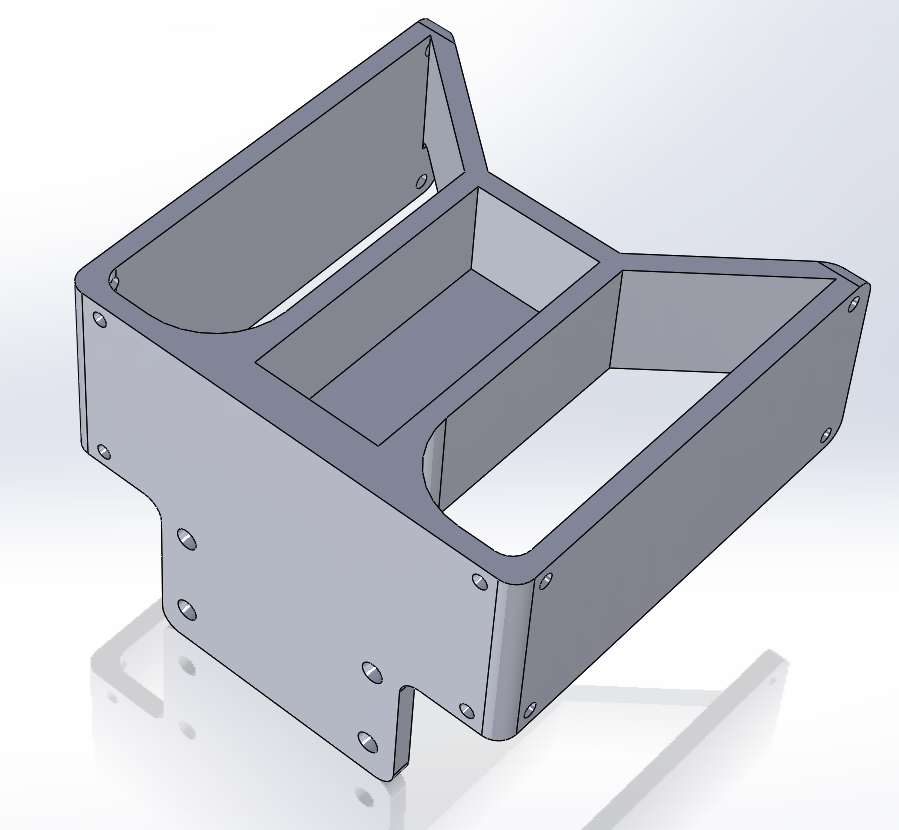
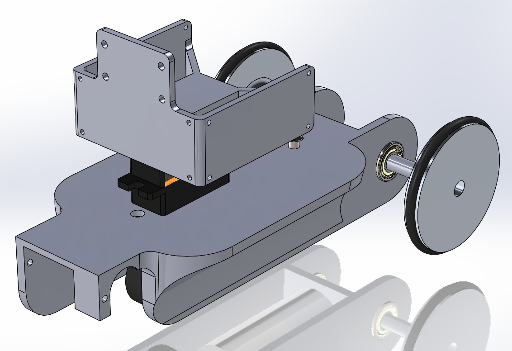
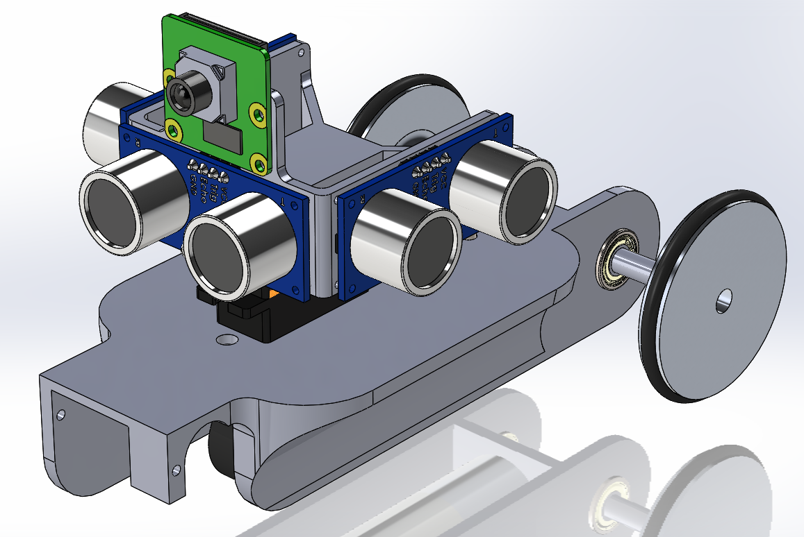
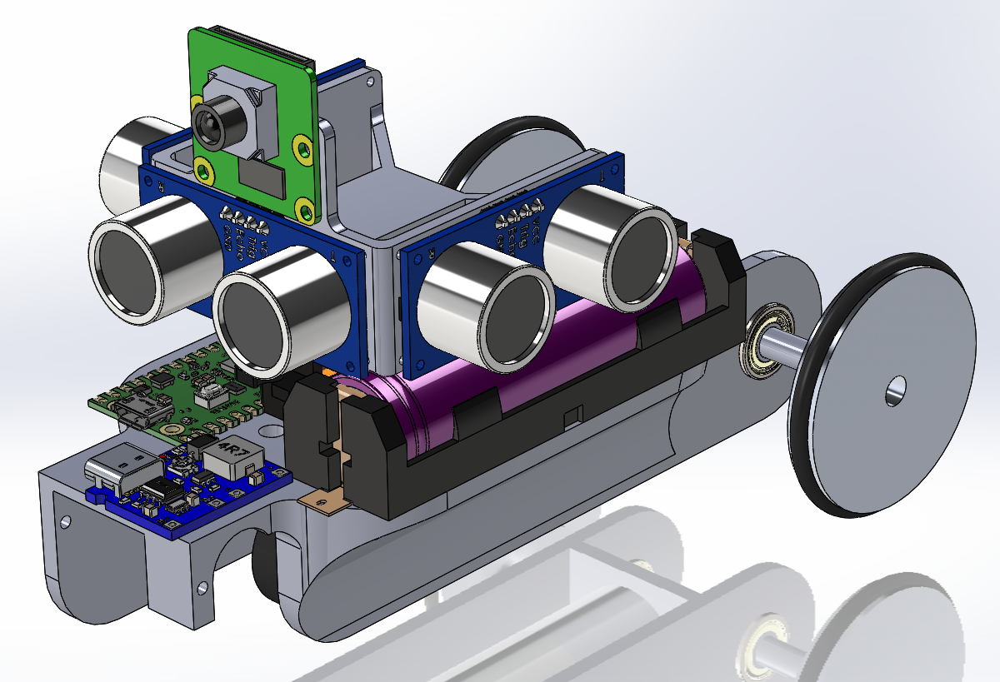
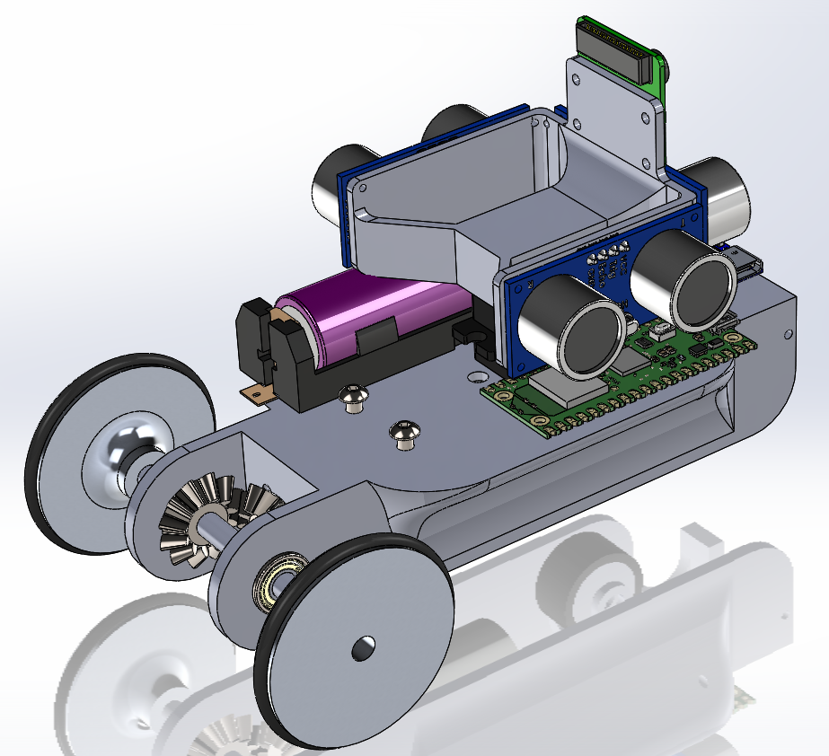

# March 19, 2024
## Ladybug
### Components
#### Ultrasonic sensors and camera
Last session, I ended up with this for the chassis of the Ladybug :

    

    Chassis of the Ladybug

Today, I will continue to work on how the sensors will be placed on the chassis. I will start with the ultrasonic sensors and the camera. Because I want the robot to be as compact and as light as possible, I had the idea to use the servo motor as a support for the sensors. This way, I can use a small piece to attach the sensor to the servo. The bracket clips onto the servo motor. Here is the result :

    

    The support for the sensors (Front view)

    

    The support for the sensors (Back view)

    

    The support for the sensors (Bottom view)

    

    The support for the sensors mounted on the servo motor

Now, I can screw the ultrasonic sensor and the camera on the support.

    

    The ultrasonic sensors and the camera mounted on the support

#### Battery, Raspberry Pi pico W and BMS
The rest of the components are directly placed on the chassis.

    

    The battery, the Raspberry Pi pico W, the BMS (Battery Management System) on the chassis (Front view)

    

    The battery, the Raspberry Pi pico W, the BMS (Battery Management System) on the chassis (Back view)

#### DWM1001-DEV module
The DWM1001-DEV module is a bit particular because it has to be placed on the top of the robot, in the center, **vertically**. I had to design a specific support for it which is screwed on the chassis. The support is very simple, it is just an extruded T shape, held by to screws to the chassis. Here is the result :

    

    The support for the DWM1001-DEV module

    

    The support for the DWM1001-DEV module mounted on the chassis

    

    The DWM1001-DEV module mounted on the support

