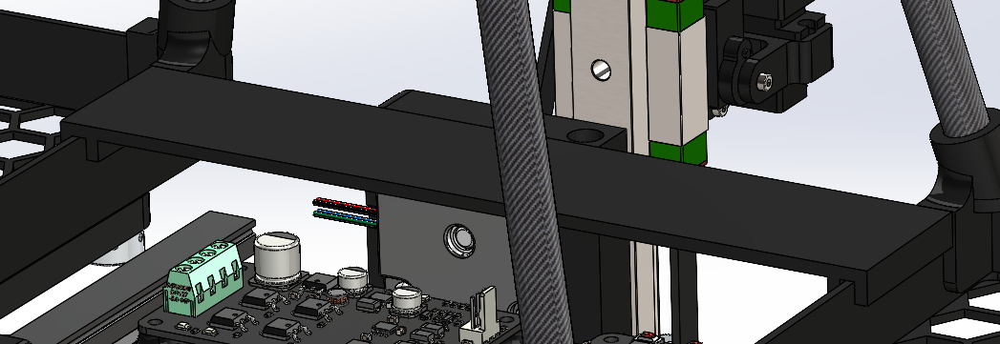

# March 29, 2024
## Battery rack
In order to mount the batteries on the robot, I designed two "baskets" that will hold the batteries on both sides of the robot. The baskets are 3D printed in PETG for strength and durability. The bottom of the baskets have a honeycomb hole patern to lighten the weight of these parts. The batteries are held in place by a strap that goes around the battery and through the basket. The baskets are mounted on the robot using two M4 screws. Between the baskets and the robots, there are 3D printed spacers so the horizontal linear actuators can operate under them. 

On one side of the robot, the batteries are connected in series to provide 24V to it (2*3S = 24v). On the other side, only one battery is connected to provide 12V to the cameras.

    

    A battery rack

    

    A mounted battery rack

## Mounting for electronics
I designed a mounting plate for the electronics that will be mounted on the robot. The plate is 3D printed in PETG. The electronics are mounted on the plate using zip ties. The plate is mounted on the robot's battries racks using super glue.

    

    Electronics mounting plate

### Next session
- Mount the electronics on the robot
- Connect the batteries to the robot
- Designed the cameras mounting system