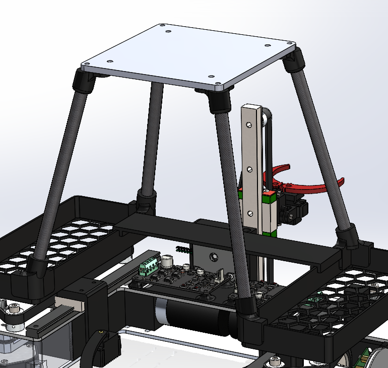
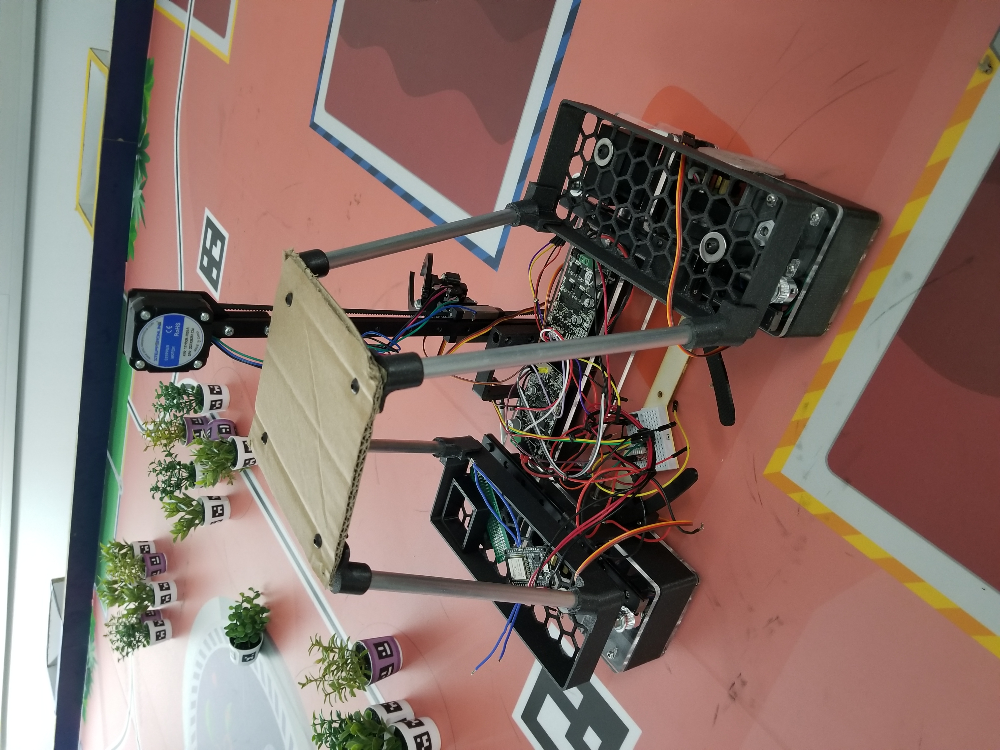
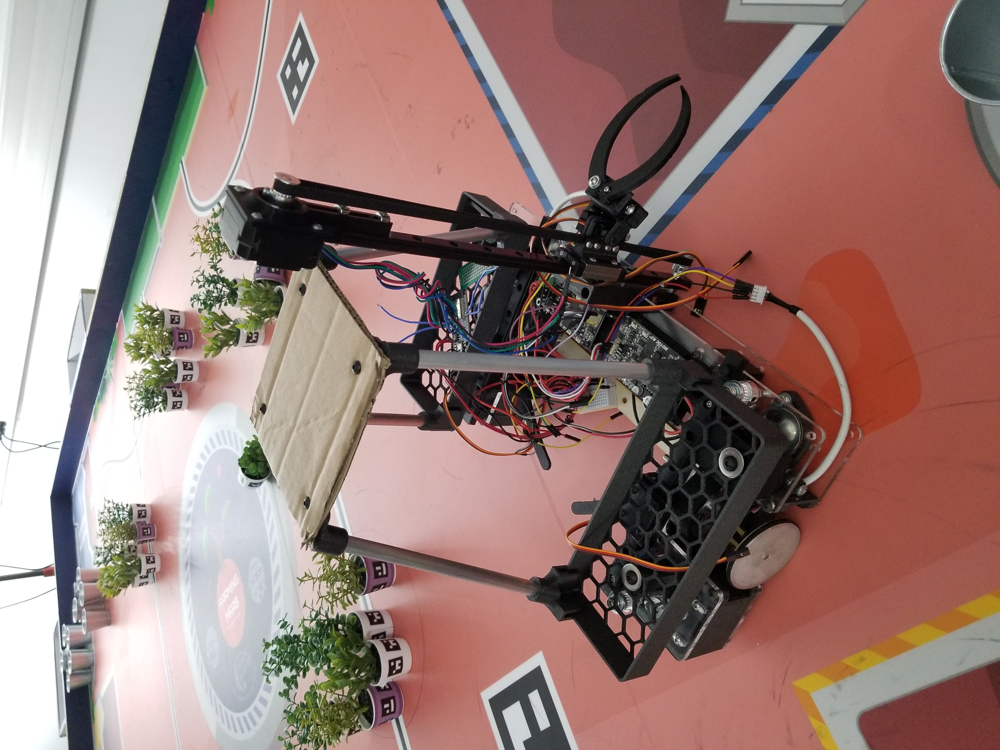

# April 02, 2024
## Cameras mounting platform
The cameras mounting platform is attached on top of the rolling base of the robot. It is composed of four aluminum tubes that are attached to the base with a 3D printed part. The platform is scarre and measures 120mm. Before laser cutting the platform itself in acrylic glass, I made one using cardboard to make sure the dimensions were correct. The platform is attached to the tubes with 3D printed parts and screws. 

    

    The platform on the robot

  

> The cardborad prototype.

   

> The 3D printed parts and the plexiglass platform.

## Next session
Next session, I will work on the cameras mounting system.
