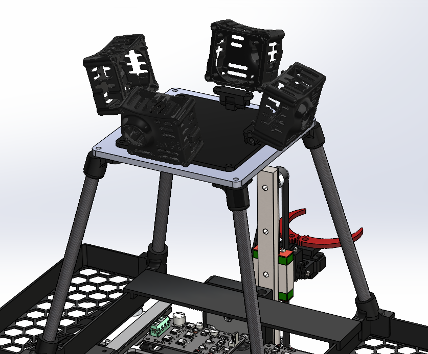

# April 09, 2024
## Cameras mouting system
To mount the cameras on the platform, I designed a mounting system that allows to easily adjust the angle of the cameras. The system is composed of a 3D printed part that can be attached to the platform using fou M4 screws. Then, a small part must be glued on the camera fan to attach it to the 3D printed part. The camera can be rotated and tilted to adjust the angle. The system is working well and the cameras are now mounted on the platform.

 

> The camera mounting system in SolidWorks

> The camera mounting system for real

## Next session
- Assemble the emergency stop button
- Design the beacon mast