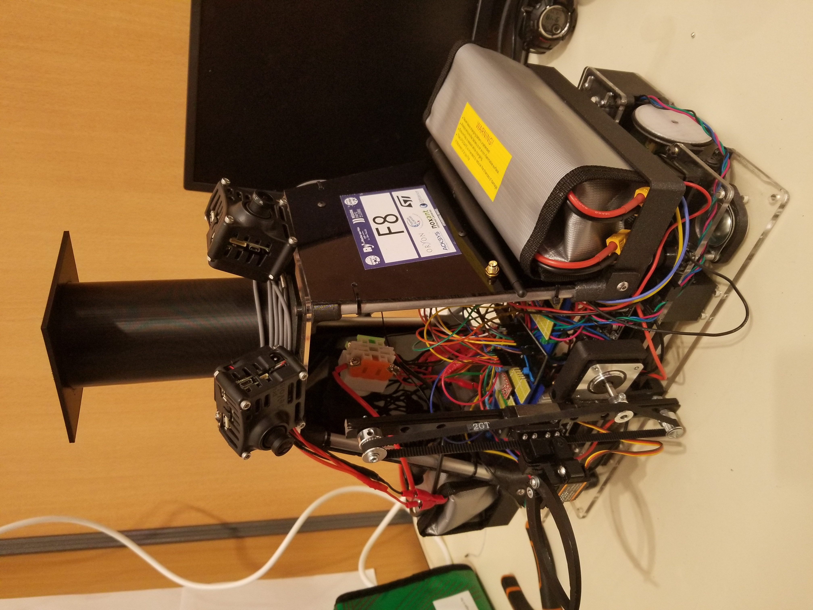

# April 16, 2024
## Emergency Switch
During this session, I mounted the emergency switch to the robot. I placed it on the most accessible area possible, so that it can be easily reached in case of an emergency. I also connected the switch to the robot's power supply, so that it can cut off the power in case of an emergency. I tested the switch to make sure it works properly, and it does. The robot is now equipped with an emergency switch, which will enhance its safety features so we will be able to homologate it.

> The emergency switch mounted on the robot.

## Ultrasonic Sensors
Also, I mounted the ultrasonic sensors on the robot. I placed them on the top platform of the robot, facing forward and backward. I connected the sensors to the robot's main board, and tested them to make sure they work properly. The sensors are now ready to be used for obstacle detection and avoidance. This feature is essential for the robot to be able to participate in the competition.

## Beacon mast
Finally, I mounted the beacon mast on the robot. I placed it on the top platform of the robot, so that it can be easily seen from a distance.

## Next session
- Participate in the competition.