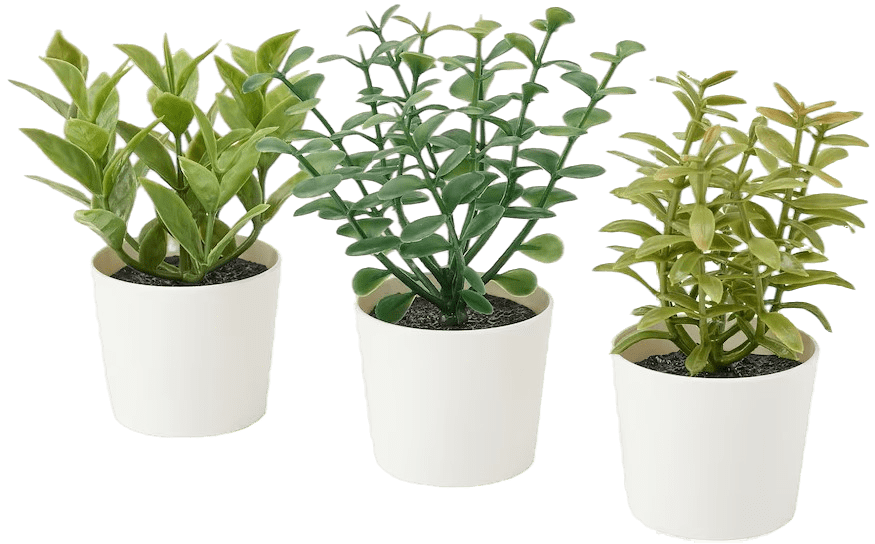
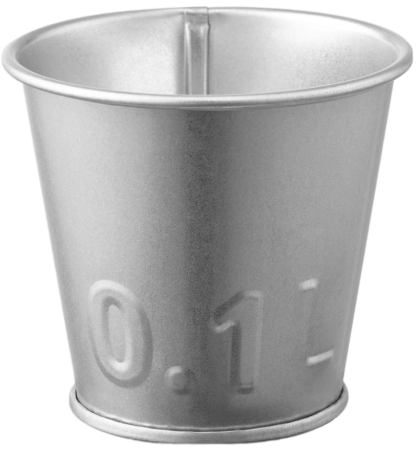

## Objectifs
Le robot a pour objectif d'effectuer plusieurs tâches en complète autonomie. Les travaux à effectuer sont les suivants :
- Ramasser différents types de plante

- Mettre les plantes dans des pots

- Apporter les plantes dans une zone prédéfinie

- Trier les plantes par type

> Deux plantes fragiles, une plante résistante

- Orienter des panneaux solaires

L'ensemble des travaux doit être réaliser dans un temps imparti et sans colision avec son envirronnement (murs, autres robots, plantes, pots).

## Contraintes
- Dimmension du robot :
    - Périmètre compris entre 1200 et 1300 mm

    
    
    - Hauteur inférieure à 350 mm

## Composants principaux
- Châssis / Base roulante
- Système de préhension (pince sur rail)
- Systèmes de vision (caméras, capteurs)
- Système de stockage (plateau tournant)
